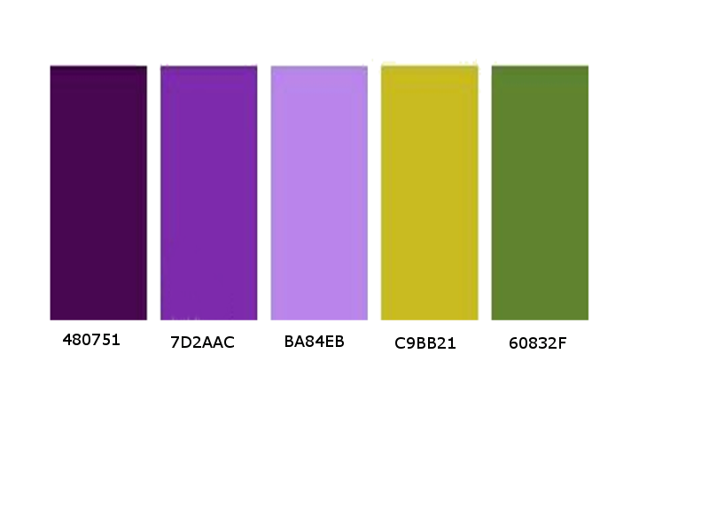
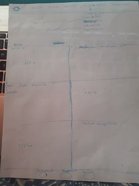
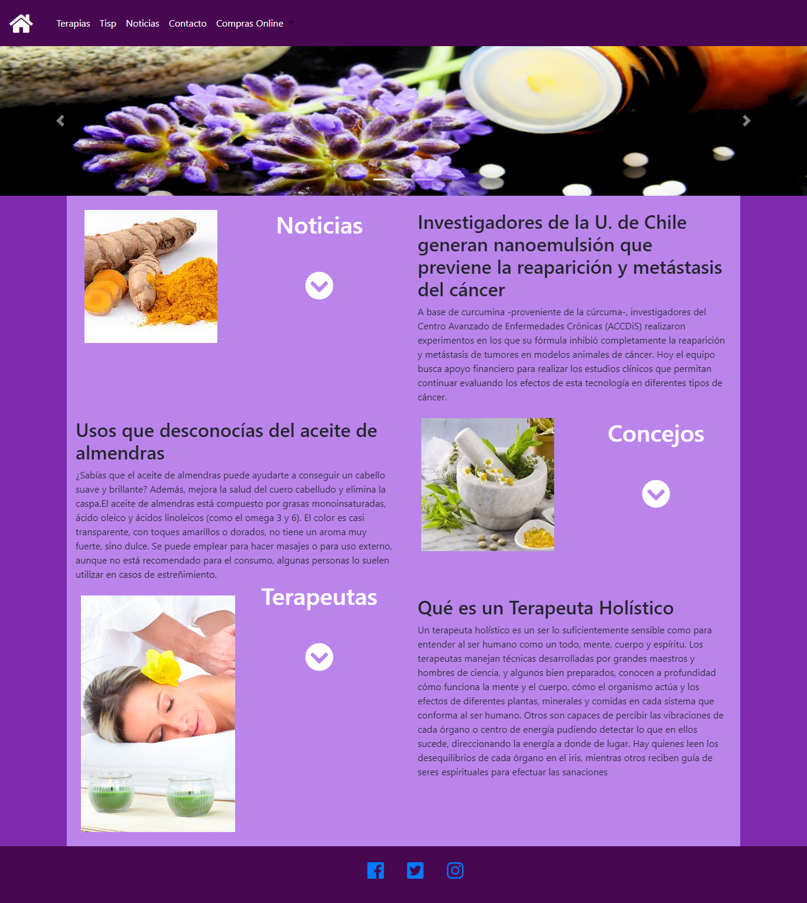

# Tema seleccionado Página web de Vida Sana en la comuna

Terapias alternativas y productos Naturales

## Los objetivos para la interfaz (ui) y para la experiencia del usuario (ux):

###ux:

La página estará enfocada para toda la familia, será una ayuda práctica para informar de manera certera sobre las nuevas tendencias en salud respaldado por un equipo profesional. Tomando en cuenta que existe poca información, lugares de venta establecidos donde encontrar productos de calidad  y certificados dentro de nuestra comuna, daremos  toda la información posible en nuestro sitio, además de consejos prácticos, como también, información de profesionales y centros terapéuticos dentro de Quilicura.
Para lograr esto el usuario tendrá una navegación fácil de realizar donde los accesos a sitios de interés incluirá imágenes grandes con una breve referencia de cada terapia, podrá realizar compras online y consultas a diversos profesionales. Además, tips  de alimentación, agendar citas con terapeutas, todo esto al alcance de un click.
Su contenido será en colores vivos agradables a la vista,  con letras e iconos grandes pensados para todo tipo de usuarios, con la finalidad que los usuarios encuentren de forma fácil y rápida lo que buscan y consideren volver a la página por nueva información.
La versión móvil dará énfasis a mostrar las imágenes con opción de ver más información a través de un botón, para que el usuario acceda mucho más rápido a la información que necesite en el momento.

###ui: 

La página será responsiva, tipo blog, con un navbar de 5 link (misión, blog, centros terapéuticos, compras online y contáctanos) con  un icono al costado derecho que llevara al inicio de la página junto con un banner que cambiará según la página en que el usuario se encuentre.
Para nuestra main se usaran 6 grillas de tamaño 6, distribuidas en dos filas que mostrara una imagen referente al tema en cuestión y al costado información relacionada al mismo tema con un botón de acceso a más información.
El footer tendrá 3 iconos que llevan directo a nuestras redes sociales.
La versión móvil estará compuesta por el navbar donde las opciones se mostrarán a un costado, sin banner, la main contendrá la imagen referente al tema y un botón para acceder a su información. En su footer tendrá los iconos de las redes sociales.

###Paleta de Colores

###Tipografía sacada de google fonts

- títulos: Galada
- Navbar : Song Myung
- párrafos: Song Myung 

##Los requerimientos del sitio:
 navbar 

##La definición de layout:

El layout será  tipo blog, con 2 columnas, donde se muestra la imagen por un lado y la información por el otro. Este se dividirá en  3 secciones. 

##Sketch

Versión Escritorio

Versión móvil

##Mockup

home realizado con HTML, CSS y Bootstrap

